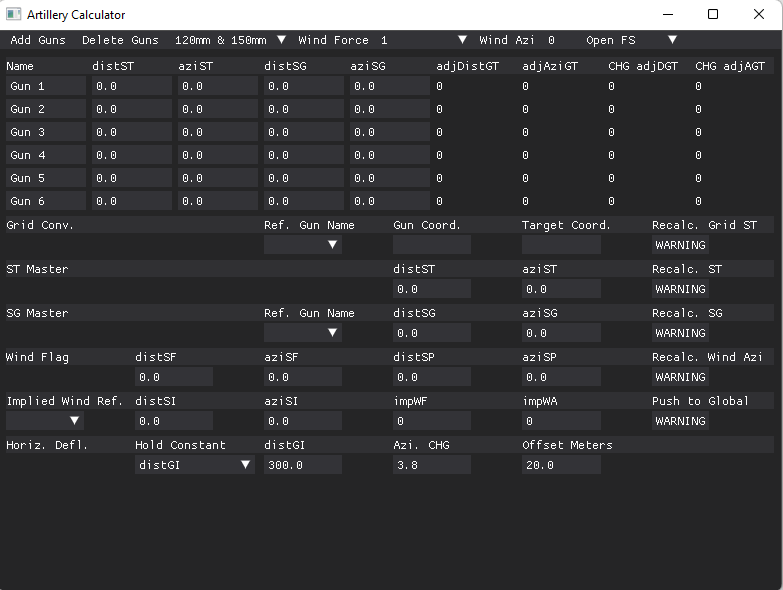

# foxholeArtilleryRefactor
Developed using DearPyGui  
&emsp;https://github.com/hoffstadt/DearPyGui 

Download CUDA/GPU drivers to use EasyOCR in GPU mode

To use:  
&emsp;cd foxholeArtilleryRefactor root folder  
&emsp;pip install -r requirements.txt  
&emsp;cd into src  
&emsp;run in command line: py view.py

Should use with OnTopReplica for in-game overlay  
&emsp;https://github.com/LorenzCK/OnTopReplica/releases  
&emsp;alt + tab: to enter inputs

Global hotkey keybinds can be altered by changing the keybinds.txt file  
&emsp;column 1: indicates keybind  
&emsp;column 2: indicates which firing solution row is referred to  
&emsp;column 3: target = distST & aziST | gun = distSG & aziSG  
&emsp;&emsp;1,global = changes ST values for all rows  
&emsp;&emsp;2,global = changes spotter to gun values for all rows by first inputting reference values for one spotter to gun  

